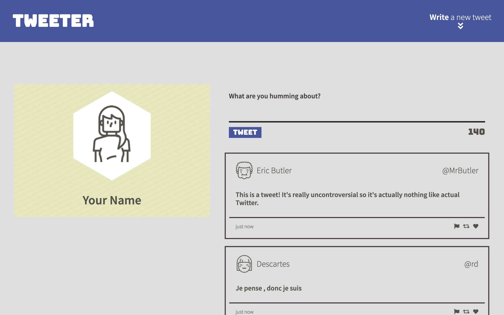
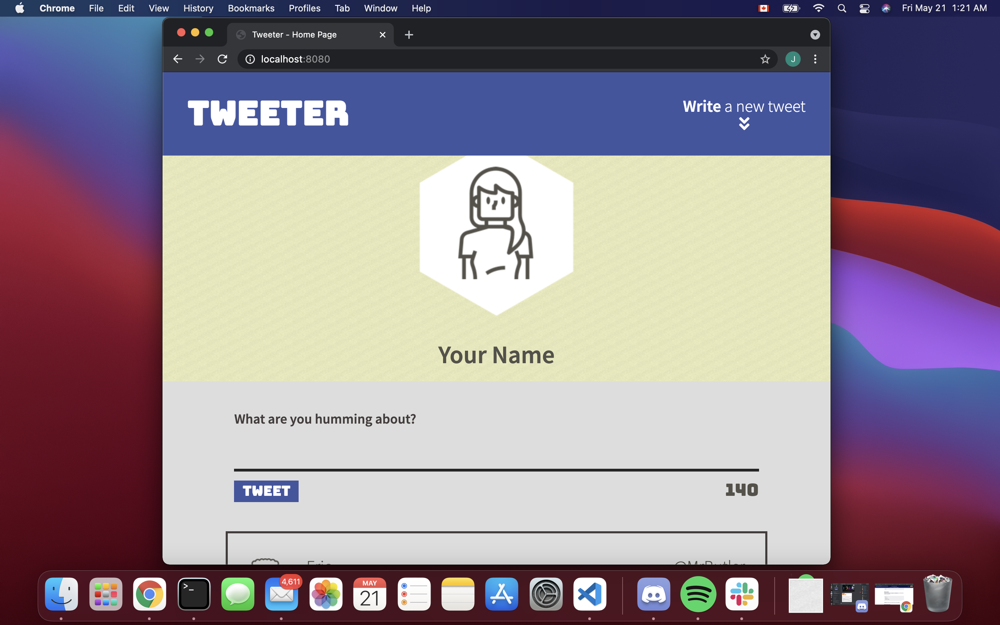
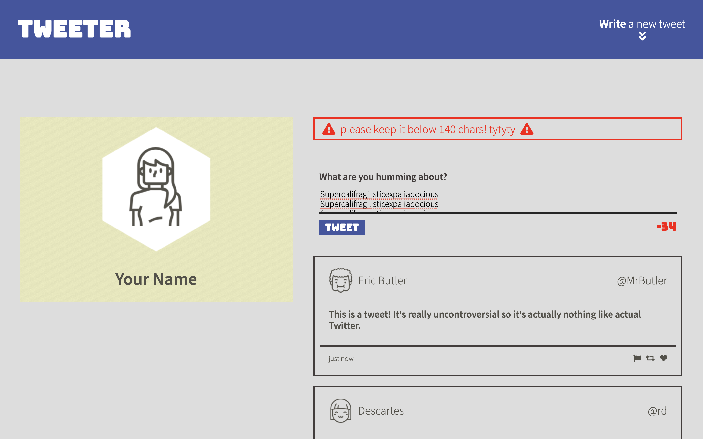
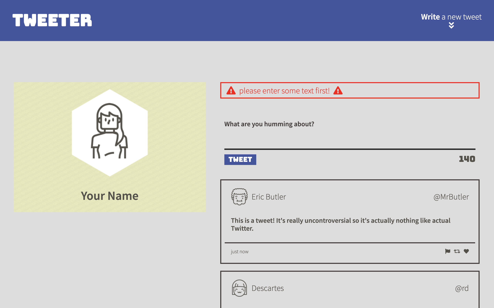

# Tweeter Project

Tweeter is a simple, single-page Twitter clone. Tweets from users are rendered immediately on the front page. 

Currently, Tweeter is designed to be responsive to:
- Desktops
- Mobile

Technologies Used:
- HTML
- CSS
- JS
- jQuery
- AJAX
- Node
- Express

## Cool Screenshots!
Tweeter Main Page

Tweeter Mobile Main Page

Tweeter Character Limit Notification

Tweeter Empty Input Notification

## Getting Started

1. Fork this repository, then clone your fork of this repository.
2. Install dependencies using the `npm install` command.
3. Start the web server using the `npm run local` command. The app will be served at <http://localhost:8080/>.
4. Go to <http://localhost:8080/> in your browser.

## Dependencies

- Express
- Node 5.10.x or above
